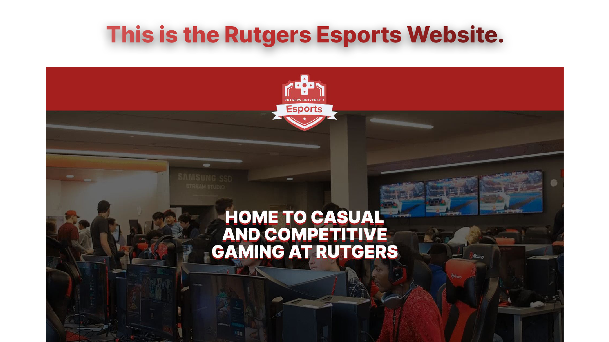

<picture>
    <source
        srcset="images/preview-dark.png"
        media="(prefers-color-scheme: dark)"
    />
    
</picture>

   

## About
We use [React](https://reactjs.org/) and [JavaScript](https://www.javascript.com/)
to build our website, but we in the process of migrating to
[TypeScript](https://www.typescriptlang.org/).

## Project Structure
 - `src/components` contains all of the components used to build a website page
 - `src/data` contains all data for clubs and open job positions
 - `src/icons` contains all icons that are in the `svg` format
 - `src/images` contains all images that are being rendered onto the website
 - `src/pages` contains all of the pages that are being displayed
 - `src/videos` contains all types of videos

## Contributing
Before you create a pull request, please create an issue using our
[issue tracker](https://github.com/rutgersesports/rutgersesports.github.io/issues)
to avoid any work efforts being lost.

### How to Write an Effective Issue
1. Use a clear and descriptive title an enhancement request
2. Include screenshots or GIFs if your issue is related to a rendering issue
3. Explain why your enhancement would be useful to the website itself

### Limitations to Outside Contributors
We welcome all outside contributors to help out on building our website, but there are
some limitations if you are not a core member of the development team.
1. Your pull request must have a low impact
2. You cannot make a complete redesign of a website page
3. New design choices are decided by the core development team

### Instructions to Build
1. Install [NodeJS](https://nodejs.org)
2. Install the [Git CLI](https://git-scm.com/downloads)\
You can also install [GitHub Desktop](https://desktop.github.com/) for a user interface
(optional)
3. Install [TypeScript](https://www.typescriptlang.org/) by running `npm i typescript`
4. Run `npm install` to install all dependencies
5. Run `npm start` to create a local server to start contributing!

We also use [Prettier](https://prettier.io/) for code formating so
please run `npx prettier --write "src/**/*.js"` whenever you're creating
a pull request.

### Deploying the Website via GitHub Pages
We currently have a GitHub Actions workflow file working on that. Just push anything
to the main branch via a direct commit or pull request and changes will be made to the
website in a few minutes.